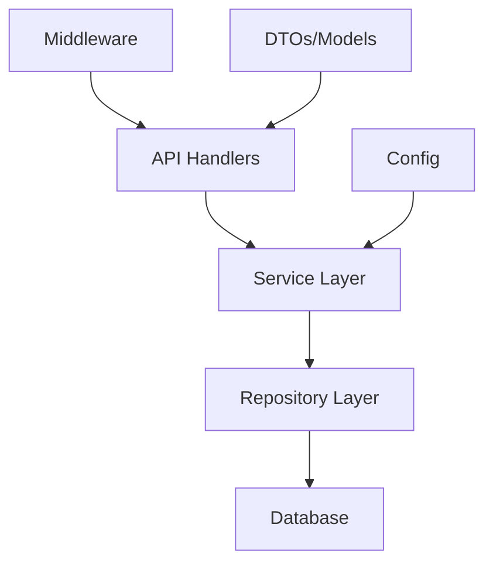
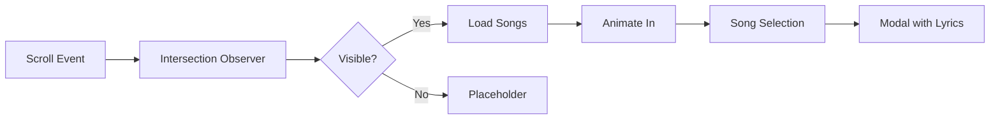

# Project Quality Assessment & Improvement Plan

**Project**: Cenidim Web (Centro Nacional de Investigación, Documentación e Información Musical)
**Date**: 2025-05-10
**Reviewer**: Architecture Assessment

---

## Executive Summary

The project is well-structured with good separation of concerns. However, several security, testing, and design issues need attention. The backend follows solid patterns, but the frontend has inconsistencies that need harmonization.

---

## Current State Analysis

### ✅ Strengths

1. **Backend Architecture (Go/Gin)**
   - Clean separation of handlers, middleware, and models
   - Proper use of dependency injection
   - Good JWT authentication implementation
   - Role-based access control (viewer < editor < admin)
   - Prepared statements for SQL injection prevention
   - Comprehensive integration tests with in-memory SQLite

2. **Frontend Structure**
   - React with proper component organization
   - Chart.js integration for dashboards
   - CSS design system with CSS variables
   - Responsive design with mobile breakpoints

3. **DevOps**
   - Docker Compose orchestration
   - Health check endpoints
   - Distroless backend image consideration

4. **Testing**
   - Backend has good test coverage (handlers, middleware, main)
   - Frontend has React Testing Library tests

---

## 🚨 Critical Issues

### 1. Security Vulnerabilities

| Issue | Severity | Location | Description |
|-------|----------|----------|-------------|
| Hardcoded JWT Secret | **CRITICAL** | [`middleware/auth.go:22`](backend/middleware/auth.go:22) | Fallback secret "cenidim-secret-change-in-production" in production code |
| CORS Wildcard | **HIGH** | [`main.go:45`](backend/main.go:45) | `AllowOrigins: []string{"*"}` exposes API to any origin |
| Missing Rate Limiting | **HIGH** | Global | No brute-force protection on `/api/auth/login` |
| SQL Injection Risk | **MEDIUM** | [`songs.go:93`](backend/handlers/songs.go:93) | LIKE clause with user input needs strict validation |

### 2. Frontend Issues

| Issue | Severity | Location | Description |
|-------|----------|----------|-------------|
| Outdated React | **HIGH** | `frontend/package.json` | React 19.2.4 with react-scripts 5.0.1 (deprecated) |
| Hardcoded Dashboard Data | **HIGH** | [`DashboardView.jsx`](frontend/src/components/DashboardView.jsx:18) | Uses dummy data instead of real DB metrics |
| Incorrect README | **MEDIUM** | [`frontend/README.md:8`](frontend/README.md:8) | Mentions "Python backend" but it's Go |
| Timeline Static Data | **MEDIUM** | [`Timeline.jsx`](frontend/src/components/Timeline.jsx) | No real-time updates, static render |

### 3. Testing Gaps

| Issue | Severity | Location | Description |
|-------|----------|----------|-------------|
| No Auth Handler Tests | **HIGH** | `handlers/` | No test coverage for Login, Register, Me |
| No Admin Handler Tests | **HIGH** | `handlers/admin_test.go` | File exists but no tests |
| No Timeline Component Tests | **MEDIUM** | `components/` | Missing test coverage |
| No E2E Tests | **MEDIUM** | Project root | No Cypress/Playwright tests |

### 4. Dashboard Problems

| Issue | Severity | Description |
|-------|----------|-------------|
| Dummy Metrics | **CRITICAL** | Shows hardcoded values (14 albums, 175 songs) |
| No API Integration | **HIGH** | Doesn't fetch real data from backend |
| No Real Metrics | **HIGH** | "NLP Activo" shows "Esperando..." forever |

---

## 🏗️ Backend Design Assessment

### Pattern Analysis

The backend follows a **Layered Architecture** with clear separation:

```
┌─────────────────────────────────────────────┐
│                   main.go                    │
│  (Router & Middleware Assembly)              │
└─────────────────────────────────────────────┘
                        │
        ┌───────────────┼───────────────┐
        ▼               ▼               ▼
   ┌─────────┐    ┌───────────┐   ┌──────────┐
   │ Handlers│    │ Middleware │   │  Models  │
   │  (API)  │    │ (Auth/Log)│   │  (Data)  │
   └────┬────┘    └───────────┘   └──────────┘
        │
   ┌────┴────┐
   │database │
   │  (DB)   │
   └─────────┘
```

### Issues Identified

1. **No Repository Pattern**: Direct SQL in handlers makes testing harder
2. **No Service Layer**: Business logic mixed with HTTP handling
3. **Global DB variable**: `database.DB` is a package-level singleton
4. **Missing Transaction Support**: Multi-table operations not wrapped
5. **No Connection Pooling Config**: SQLite defaults used

### Recommended Backend Refactoring



**Changes**:
1. Extract `Service` layer for business logic
2. Add `Repository` interface for database operations
3. Use dependency injection for testability
4. Add database connection pooling settings
5. Wrap multi-step operations in transactions

---

## 📅 Timeline Redesign Requirements

### Current State
- Simple card grid with fade-in animations
- No smooth scrolling between years
- Static rendering without virtualization
- Basic hover effects

### Target: Timeline.js-style Fluidity

Requirements:
1. **Horizontal scrolling** with momentum
2. **Smooth transitions** between year groups
3. **Parallax effects** for depth
4. **Animated line** connecting years
5. **Hover scale** and glow effects
6. **Keyboard navigation** support
7. **Progressive loading** as user scrolls

### Technical Approach



---

## 📊 Dashboard Metrics Integration

### Current Database Schema

```
fonogramas
├── clave_fonograma (PK)
├── titulo
├── anio
└── ... (metadata)

songs
├── id (PK)
├── fonograma_id (FK)
├── title
├── lyrics
├── clasificacion
└── ...

users
├── id (PK)
├── username
├── email
├── password_hash
└── role
```

### Available Metrics to Display

| Metric | Source | Implementation |
|--------|--------|----------------|
| Total Songs | `COUNT(*)` from songs | New `/api/stats` endpoint |
| Total Albums | `COUNT(DISTINCT fonograma_id)` | Same endpoint |
| Songs by Classification | Group by clasificacion | Extend stats |
| Songs per Year | Group by fonograma.anio | Timeline data |
| User Activity | users.created_at | Admin stats |

### New Backend Endpoint

```go
// GET /api/stats
type StatsResponse struct {
    TotalSongs      int                    `json:"total_songs"`
    TotalAlbums     int                    `json:"total_albums"`
    SongsByYear     map[string]int         `json:"songs_by_year"`
    SongsByClasificacion map[string]int    `json:"songs_by_clasificacion"`
    RecentlyAdded   int                    `json:"recently_added"` // last 30 days
}
```

---

## 🛠️ Implementation Plan

### Phase 1: Security Hardening (Week 1)

- [ ] Fix hardcoded JWT secret - require env var
- [ ] Implement rate limiting on auth endpoints
- [ ] Tighten CORS configuration
- [ ] Add input sanitization for search queries
- [ ] Add security headers (helmet)

### Phase 2: Backend Optimization (Week 2)

- [ ] Introduce service layer pattern
- [ ] Create repository interfaces
- [ ] Add connection pooling configuration
- [ ] Implement transaction support for multi-table ops
- [ ] Add comprehensive auth handler tests

### Phase 3: Frontend Enhancement (Week 3)

- [ ] Upgrade React ecosystem (or migrate to Vite)
- [ ] Fix hardcoded dashboard with real API data
- [ ] Add `/api/stats` integration to dashboard
- [ ] Create Timeline component tests
- [ ] Update frontend/README.md

### Phase 4: Timeline Redesign (Week 4)

- [ ] Implement horizontal scroll with momentum
- [ ] Add smooth year transitions
- [ ] Create animated connecting line
- [ ] Add parallax depth effects
- [ ] Implement intersection observer for lazy loading
- [ ] Add keyboard navigation

### Phase 5: README Updates (Ongoing)

- [ ] Fix backend technology description
- [ ] Add architecture diagrams
- [ ] Document environment variables
- [ ] Add troubleshooting section
- [ ] Update screenshots

---

## 📝 Specific File Changes Required

### Backend

| File | Changes |
|------|---------|
| `middleware/auth.go` | Remove hardcoded fallback secret |
| `main.go` | Add rate limiter, fix CORS, add helmet |
| `handlers/` | Add `/api/stats` endpoint |
| `database/db.go` | Add connection pool settings |

### Frontend

| File | Changes |
|------|---------|
| `components/DashboardView.jsx` | Fetch real stats from API |
| `components/Timeline.jsx` | Add smooth animations |
| `index.css` | Harmonize button/text styles |
| `README.md` | Fix Python → Go reference |

---

## Validation Checklist

### Before Code Mode Execution

- [ ] Security audit completed
- [ ] All READMEs reviewed and corrected
- [ ] Test coverage gaps identified
- [ ] Dashboard API requirements defined
- [ ] Timeline animation specs documented

### Implementation Readiness

- [ ] Backend: New `/api/stats` endpoint designed
- [ ] Backend: Service layer pattern documented
- [ ] Frontend: Timeline component requirements specified
- [ ] Frontend: Dashboard integration points identified

---

## Questions for Clarification

1. **Timeline Style**: Should the timeline be strictly horizontal (like Timeline.js) or maintain the current pentagram/musical staff concept?

2. **Dashboard Metrics**: Which specific metrics are most important for the dashboard?
   - Songs by year distribution
   - Classification breakdown
   - Recently added content
   - User activity stats

3. **React Upgrade**: The project uses react-scripts 5.0.1 which is deprecated. Should we:
   - A) Migrate to Vite (recommended)
   - B) Keep create-react-app with updates
   - C) Stay on current version

4. **Backend Service Layer**: Is it acceptable to refactor handlers to use a service layer, or should we maintain the current direct handler-to-database pattern?